# Fraud_Detection_Project

## ○ 프로젝트 소개

[금융]이상신용거래 탐지 모델링

## ○ 데이터

Kaggle - Fraud Detection
유럽 신용카드 사용자의 거래내역 데이터이다. 총 284,807개의 거래내역을 가지고 있고 492개의 잘못된 거래내역을 포함하고 있다. positive class (frauds) 분류가 전체 거래내역의 0.172%로 highly unbalanced 되어있다.

컬럼값 설명:
모든 입력값은 PCA 변환의 결과 값들이다. 보안상의 이유로 기존의 입력값은 제공되지 않는다. 'Time'과 'Amount'를 제외한 Feature V1~V28은 주성분분석을 통해 나온 주성분이다. 'Class' 1 : 잘못된 거래내역 'Calss' 0 : 정상 거래내역

https://www.kaggle.com/mlg-ulb/creditcardfraud

## ○ 프로세스

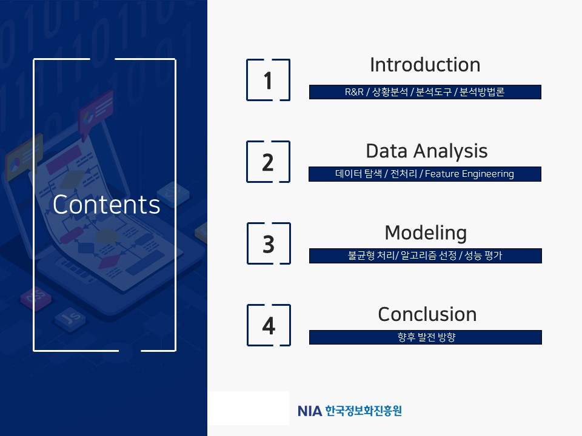

***

***

# 1. Introduction

## 1-1 R&R (Role & Responsibility)

짧은 시간 안에 프로젝트를 효율적으로 수행하기 위해 팀원 간 역할분담을 명확히 하였습니다.

## 1-2 상황/도메인 분석

데이터를 분석하고 탐색하기 전에는 반드시 관련 분야, 도메인에 대한 지식이 사전에 필요합니다. 

1. '이상신용거래(Fraud)'정의를 명확히 알기
2. 국내 금융권(은행사)의 FDS(Fraud Detection System)구축 동향 파악
3. 데이터 특성 파악
   .....
   상황분석 후, 상황에 맞는 문제해결방법을 선정하였습니다.

```
해당 분야에 대한 도메인 지식을 습득하기 위해 *경제학과,산업경영공학과 교수님들, 한국소프트웨어산업협회 (KOSA)강사님들을 찾아 뵀습니다. 또한, FDS에 대한 연구, 논문 등을 찾아* 상황분석을 하였습니다
```

#### (1) 전세계 이상거래 규모 (닐슨)

* $76억(2010) → $218억(2015) → $328억(2019)

#### (2) FDS 란?

* 전자금융거래에 사용되는 단말기 정보, 접속정보, 거래내용 등을 종합적으로 분석해 의심거래를 탐지하고 이상금융거래를 차단하는 시스템

#### (3) 국내 금융권 FDS 구축 현황

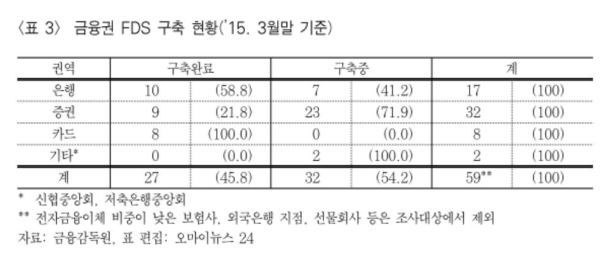

## 1-3 분석도구

```
1. Jupyter Notebook with Python (Pandas,Numpy,Tensorflow...)
2. Colab (*데이터의 수가 많고 모델링하는데 많은 시간이 소요되므로 가상 GPU기능이 탑재된 Google의 분석플랫폼 활용)
```

## 1-4 분석방법론 SEMMA

```
전통적인 데이터 분석방법론인 'SEMMA'

1. Sampling  - [분석 데이터 생성]
*Kaggle Fraud Deteciton Dataset 활용
   
2. Explore   - [데이터를 탐색적으로 분석하는 과정]
*데이터 간 특징,패턴 분석
*시각화를 통한 탐색적 분석
*변수 간 중요도 확인

3. Modifying - [데이터 수정/변환]
*해당 데이터 특징에 맞게 전처리

4. Modeling  - [모델 구축 단계]
*상황에 맞는 문제해결을 위한 모델을 생성하고 최적화

5. Assessment - [모델 평가 및 검증]
*생성 모델을 평가할 땐 상황에 맞는 주요 Metric을 명확히 선정
```

***

***

# 2.Data Analysis

## 2-1 데이터 탐색

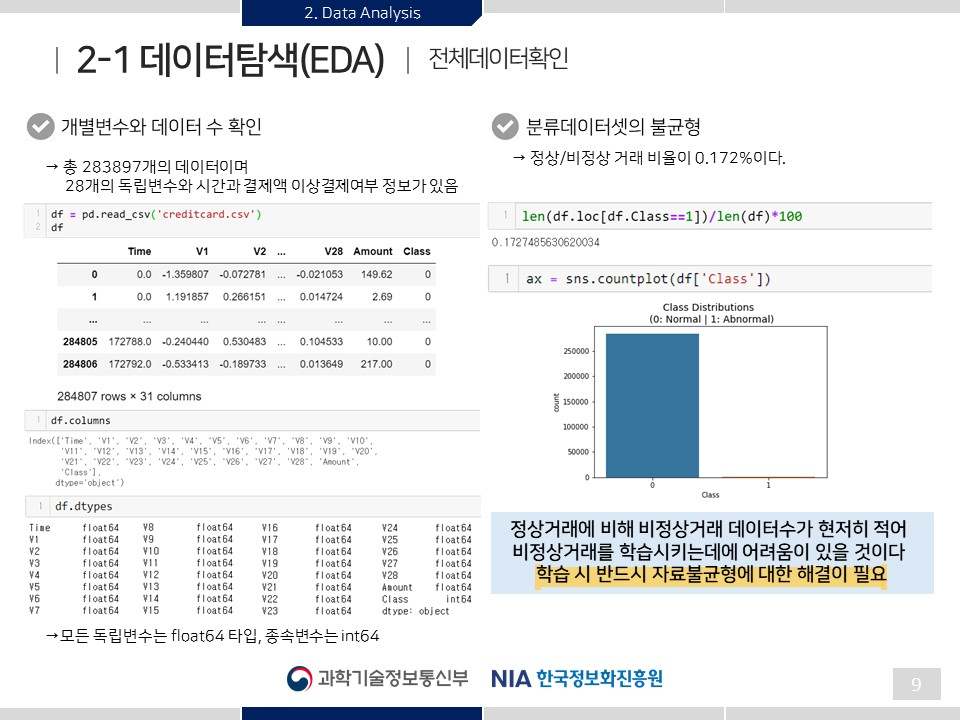

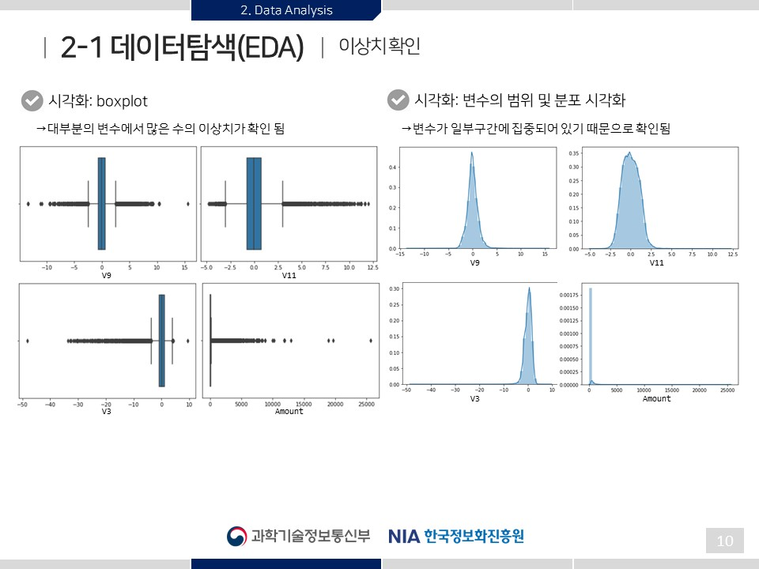

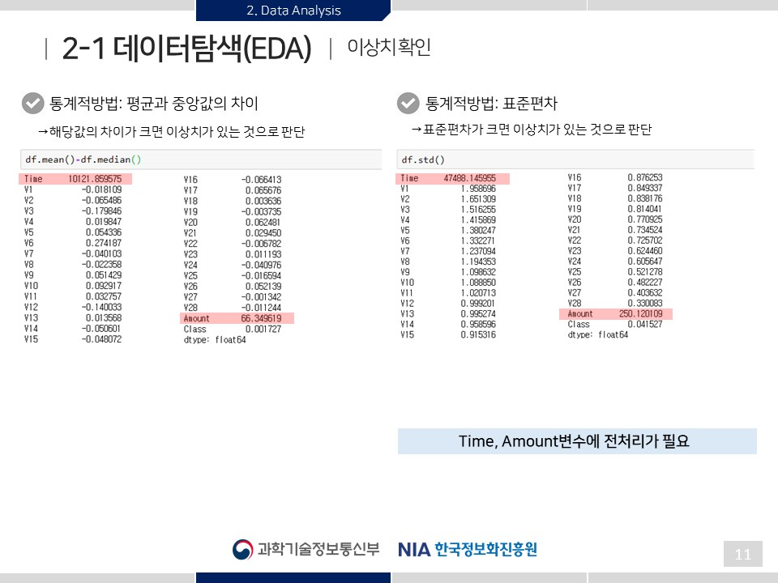

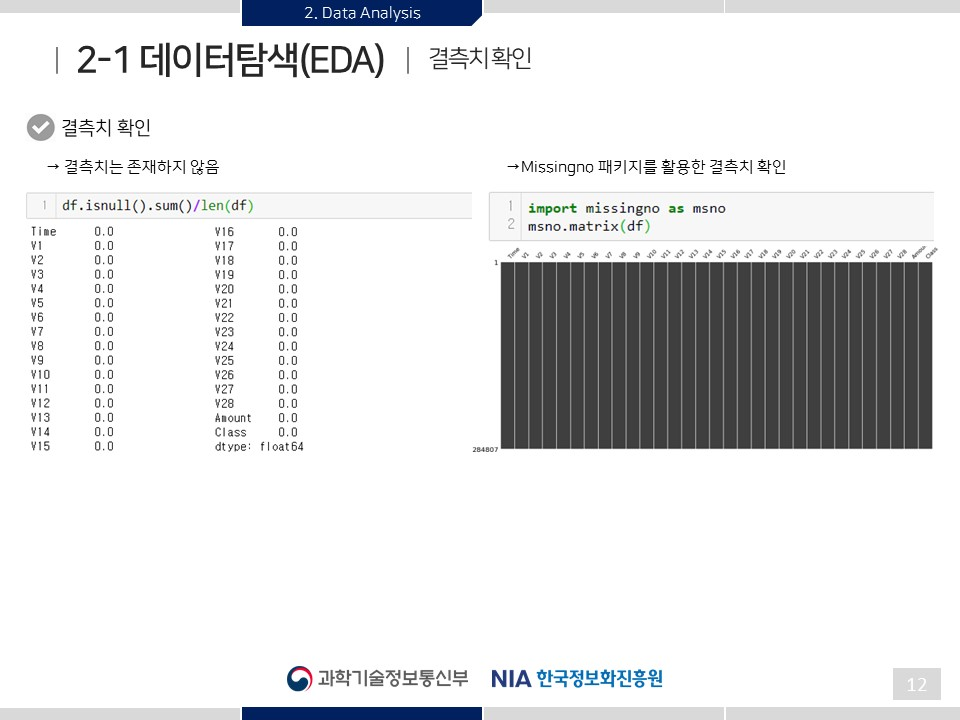

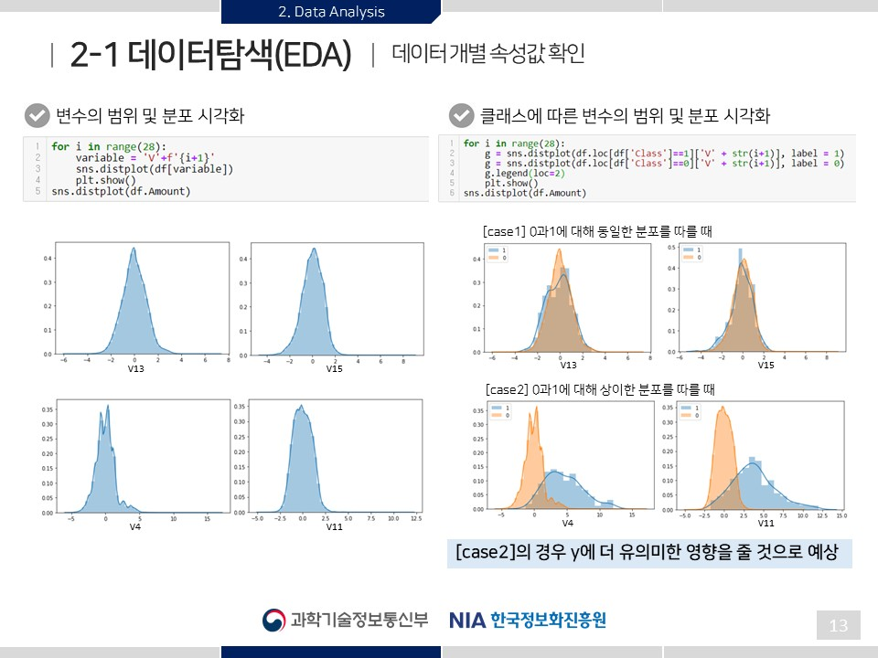

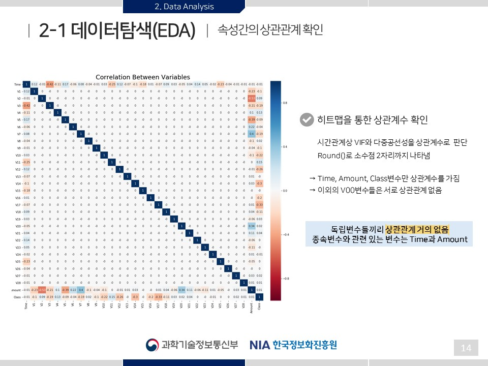

***

## 2-2 전처리

전처리 방법에는 다양한 경우의 수가 있습니다. 이전에 데이터를 탐색적으로 분석했으므로 우리가 활용한 데이터 특징에 따라 전처리 방법을 선정하여 진행합니다.

```
**이 때 표준화와 정규화의 차이를 명확히 알고 진행했습니다.
```


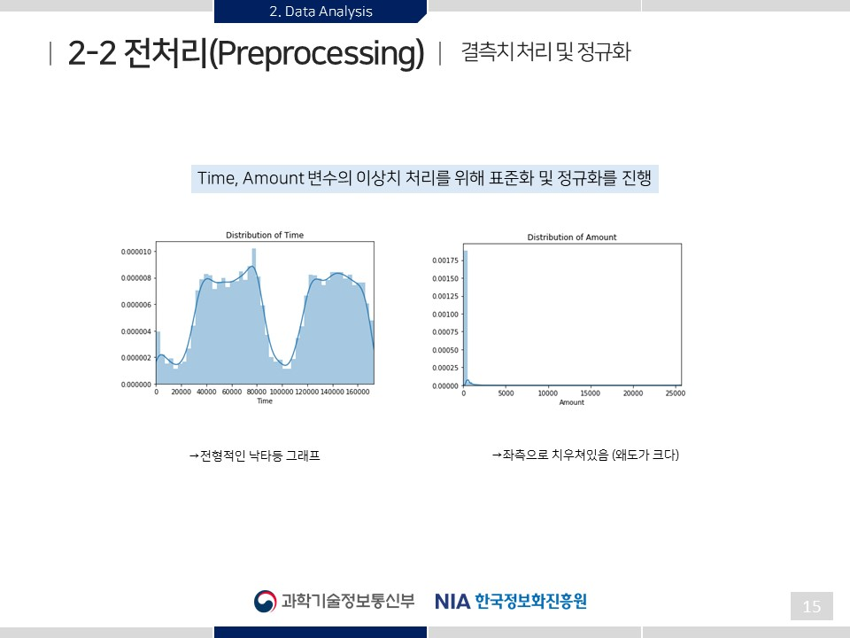

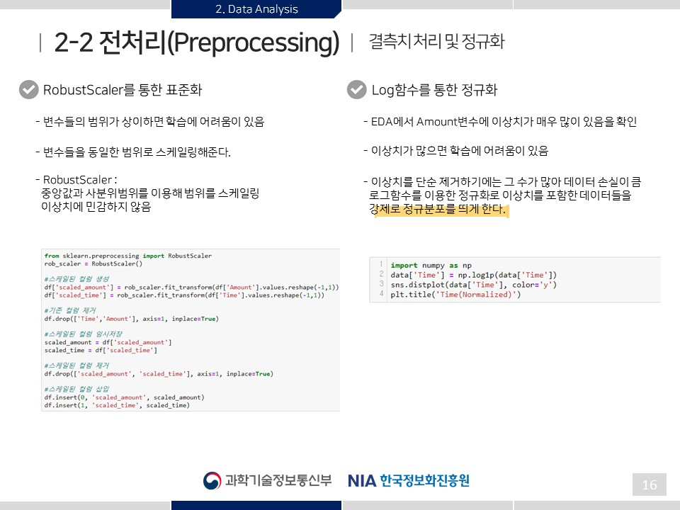

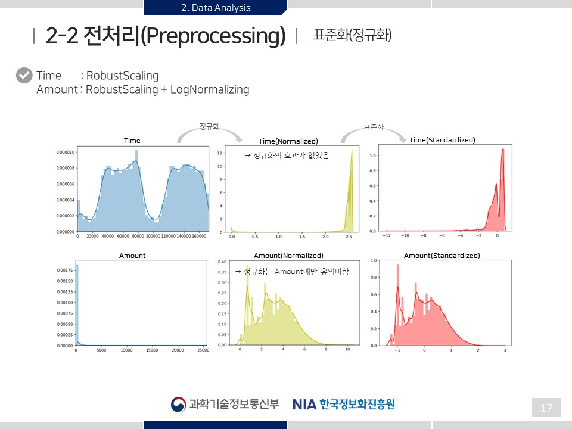

***

## 2-3 Feature Engineering

모델을 생성하기 전에 속성,변수(Feature)들을 잘 선정하여야 합니다. 하지만 데이터 셋의 특성상 이미 모든 Feature들이 PCA를 통해 추출된 변수들이므로 이 단계는 생략합니다. PCA를 마친 변수들은 이미 원본데이터의 특징들을 잘 담아내고있습니다. 다만 그 변수들의 중요도를 단순 확인하였습니다.

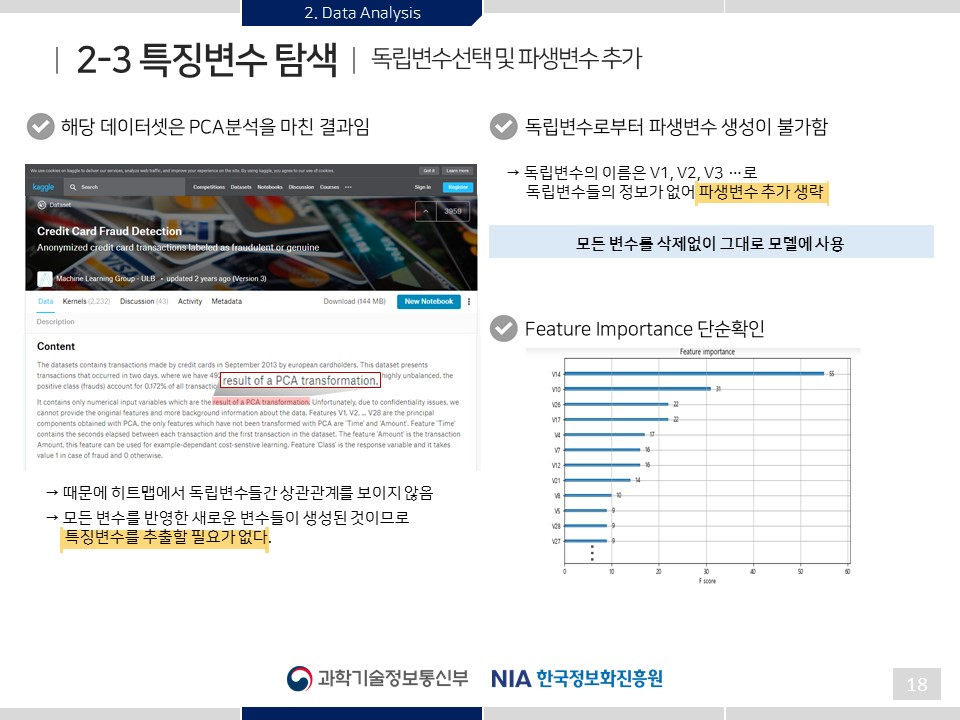

***

***

# 3. MODELING

## 3-1 불균형 데이터(Imbalanced Data) 처리

```
불균형 데이터셋을 처리하기 위한 방법에는 다양한 경우의 수가 있습니다.
https://imbalanced-learn.readthedocs.io/en/stable/user_guide.html
```

#### * SMOTE Over-Sampling

 -단순 Under-sampling은 데이터 정보손실의 문제, 단순 Over-sampling은 데이터 중복의 문제가 있습니다. 이러한 문제점을 극복하고자 'SMOTE Over-sampling'을 활용하여 해결하였습니다. 이는 소수 데이터를 선택하고 선택 데이터와의 근접한 이웃을 선택 후, 이웃과의 거리를 계산합니다. 선택된 샘플과 이웃의 거리에 0~1 사이 난수를 곱하여 '새로운 데이터를 생성' 합니다.

-오버샘플링의 단점은 과잉적합(OverFitting)이 발생할 수 있다는 점입니다. 이러한 문제점을 해결하기위해  Over-Sampling할 데이터 비율을 파라미터 조정을 통해 5:5, 6:4, 7:3 등 다양한 경우의 수를 생각하고 적용해 볼 수 있습니다. (*이진 분류/예측 문제)

```
그밖에도 저희 팀이 당면한 문제는 'Over-Sampling을 어떻게, 어떤 데이터에 할까?'였습니다.

[방법 1] 
1.전처리 된 Whole dataset에 sampling한다.
2.Train-Test set 분리한다

[방법 2]
1.Train-Test set 분리한다
2.Train dataset에만 sampling한다.

방법 2를 선택하였습니다. 근거는 다음과 같습니다.
```

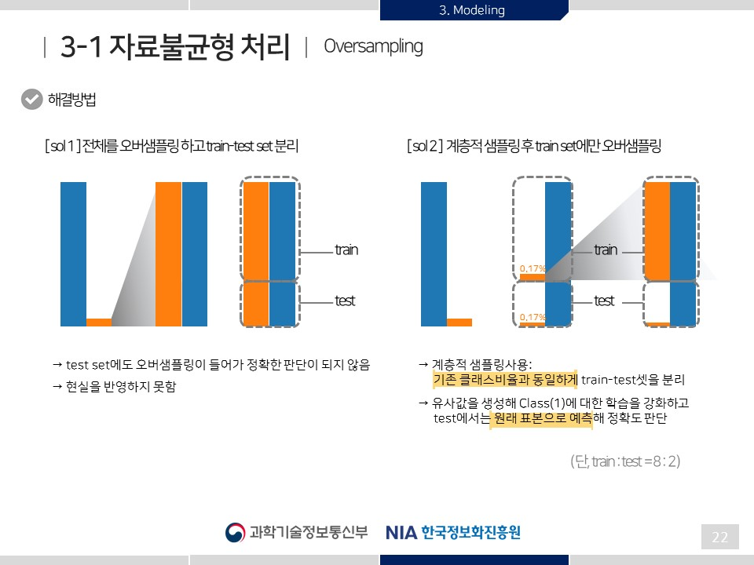

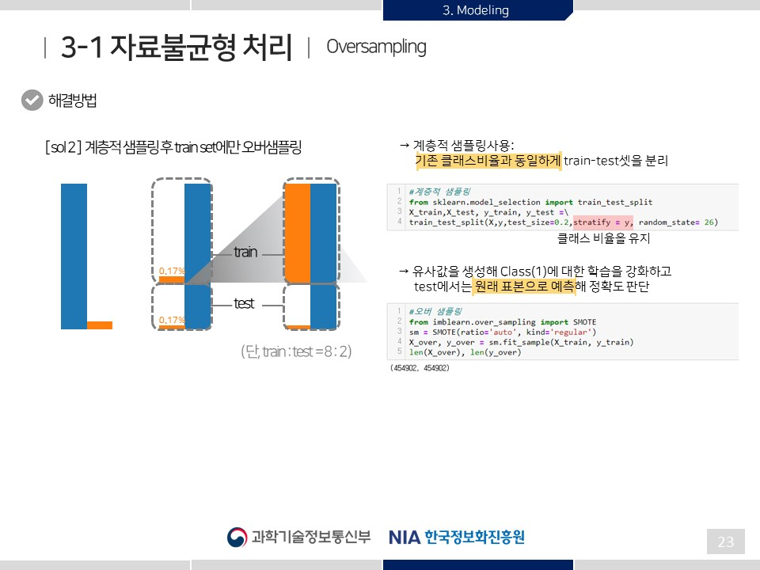

***

## 3-1 모델 알고리즘 선정

총 4개 모델 선정 이유는 다음과 같습니다.

### *RandomForest

전형적인 이상신용거래 탐지 문제상황은 배깅인 RandomForest만으로도 충분히 해결 가능합니다.

### *XGBoost & LightGBM

현업에서의 실시간 분석을 고려하여 속도가 빠른 부스팅 기법을 활용하였습니다. 특히 XGBoost는 지나치게 불균형한 데이터 문제 상황에서 뛰어난 성능을 보입니다. LightGBM은 XGBoost와 작동원리가 비슷하지만 메모리 효율성이 더 뛰어나 이 2가지 알고리즘을 선정하였습니다.

### * DNN

현재 금융권(카드사,은행사)에서 딥러닝 기반 FDS(Fraud Detection System)을 구축하고 있는 상황을 고려하였습니다.

* KB국민카드 : 2017년 딥러닝 기반 FDS 개발 완료
* NH농협카드 : 2019년 3월 딥러닝 기반 FDS 개발 완료
* 우리카드 : 2019년 하반기, 딥러닝 기반 FDS 도입 예정
* 현대카드 : 지속적인 딥러닝 기반 FDS 고도화

***

## 3-2 평가지표 선정

```
*모델을 평가할 때는 상황에 맞는 평가지표,Metric을 명확히 선정해야합니다.
```

직면한 문제는 이상신용거래 탐지입니다. 이 상황을 해결하기 위한 주요 Metric은 Recall입니다. 자세한 사항은 다음과 같습니다. 

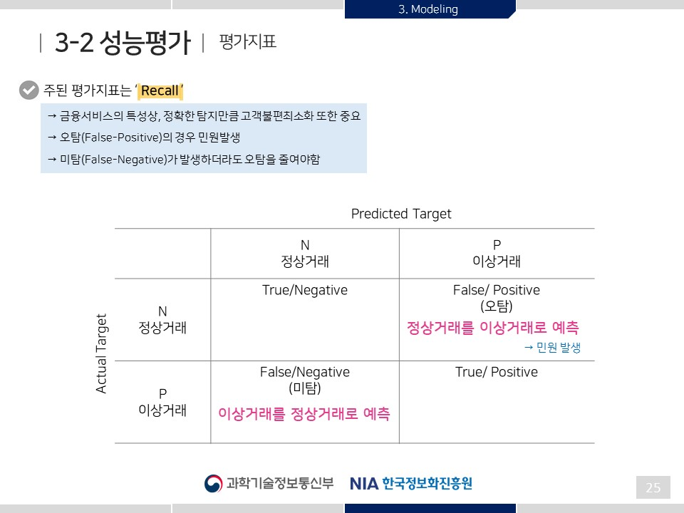

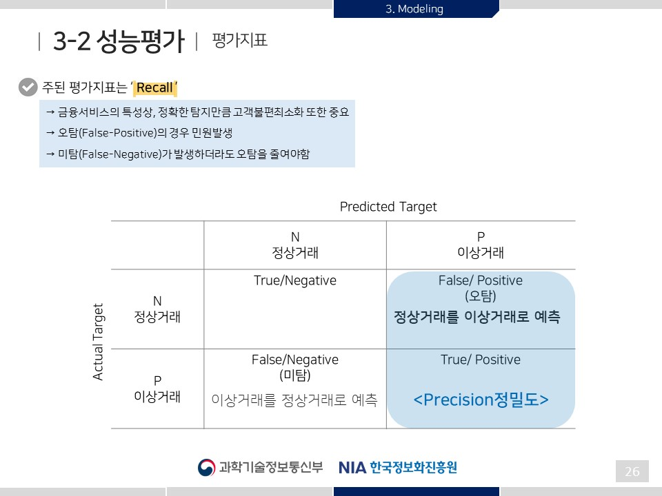

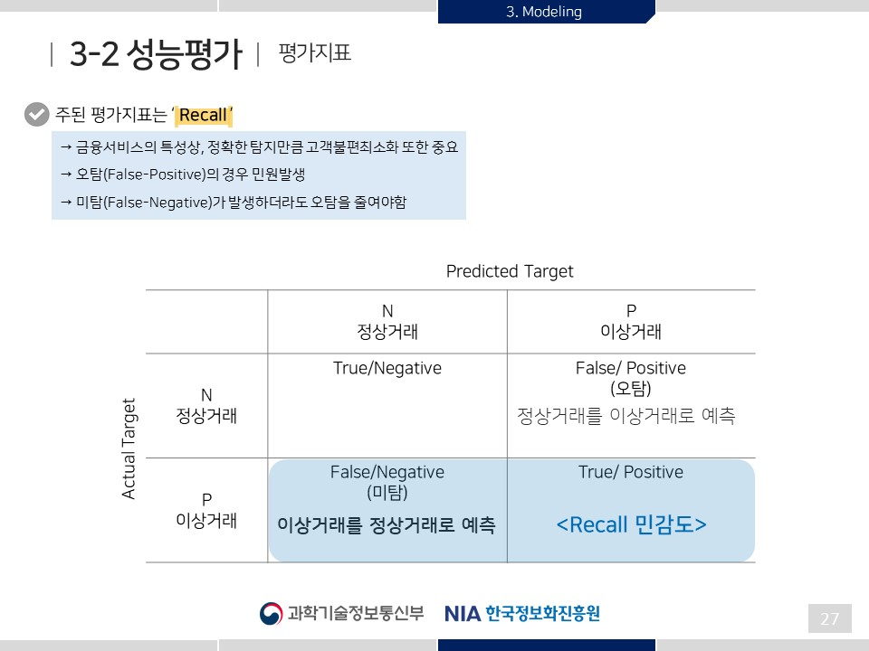

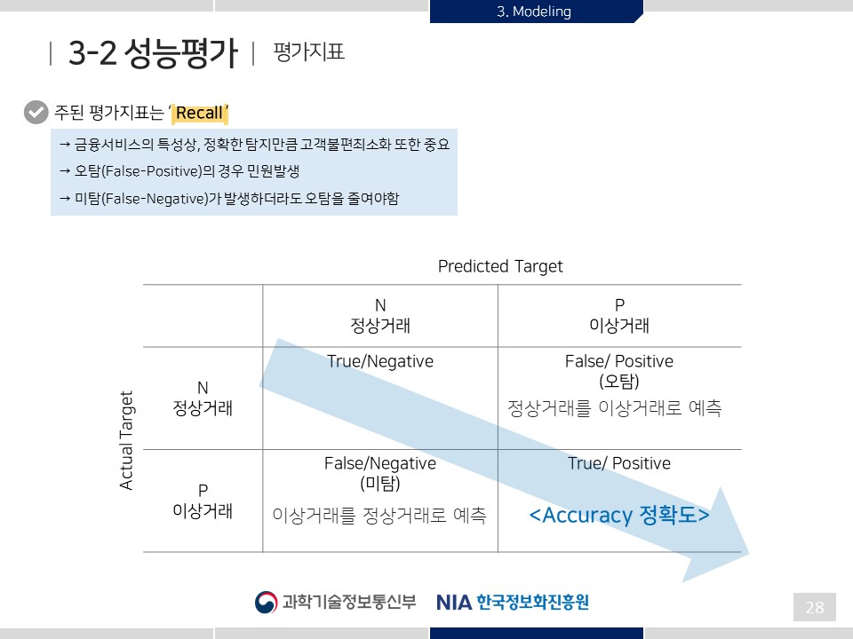

***

## 3-2 모델 생성 및 성능평가

4개의 알고리즘 별로 4가지의 경우의 수를 생각하여 총 16개의 모델을 생성하고 성능을 비교 평가하였습니다. 

```
[4개의 경우의 수]
1. 기본 모델 생성
2. 기본 모델 + 최적 하이퍼 파라미터를 찾기위한 GridSearchCV 활용
3. Over-sampling 후 기본 모델 생성
4. Over-sampling 후 GridSearchCV 활용

4개의 알고리즘 별로 위의 4가지 경우의 수를 적용하여 성능 비교평가 실시
```

### (1) RandomForest

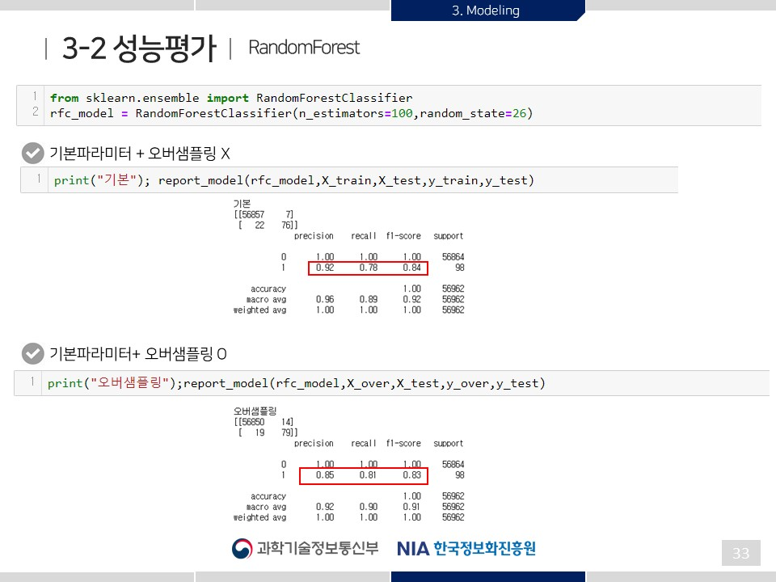

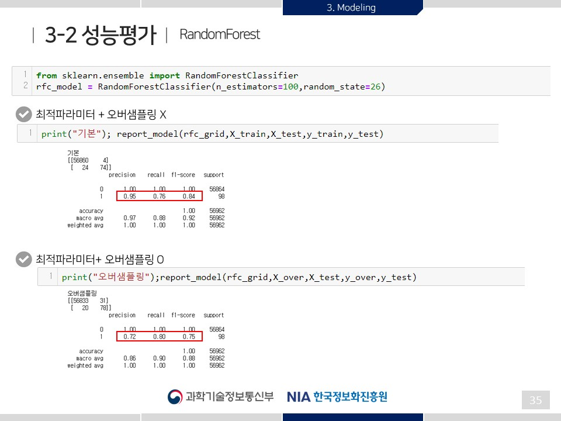

***

### (2) XGBoost 

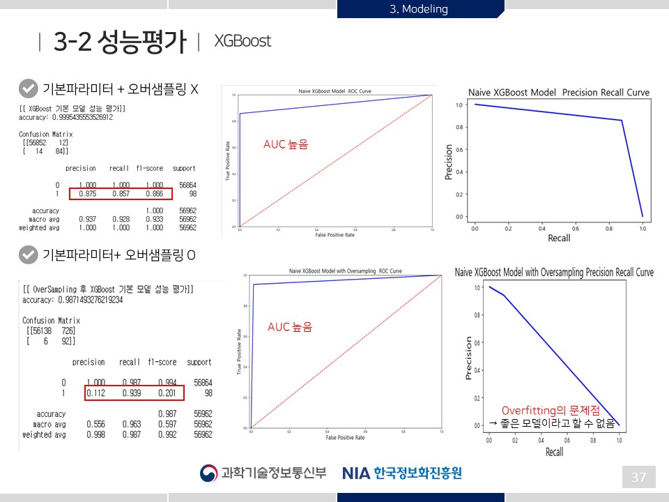

```
저희가 선정한 주요 Metric은 Recall입니다. 
하지만 다음과 같은 경우는 좋은 모델이라고 할 수 없습니다.

[ Recall은 매우 높으나 Precision이 매우 낮은 경우 ]
비정상거래라고 예측한 것 중 실제 비정상거래인 것의 비율이 매우 낮은 것이므로
이는 오탐할 가능성이 높은 것입니다.

*ROC-AUC Curve 그래프를 그려보면 성능이 좋은 것 처럼 보입니다.
하지만 오탐,미탐의 가능성을 줄이기 위해 
Precision - Recall간의 관계 또한 반드시 확인하여 모델 성능을 평가합니다.

```


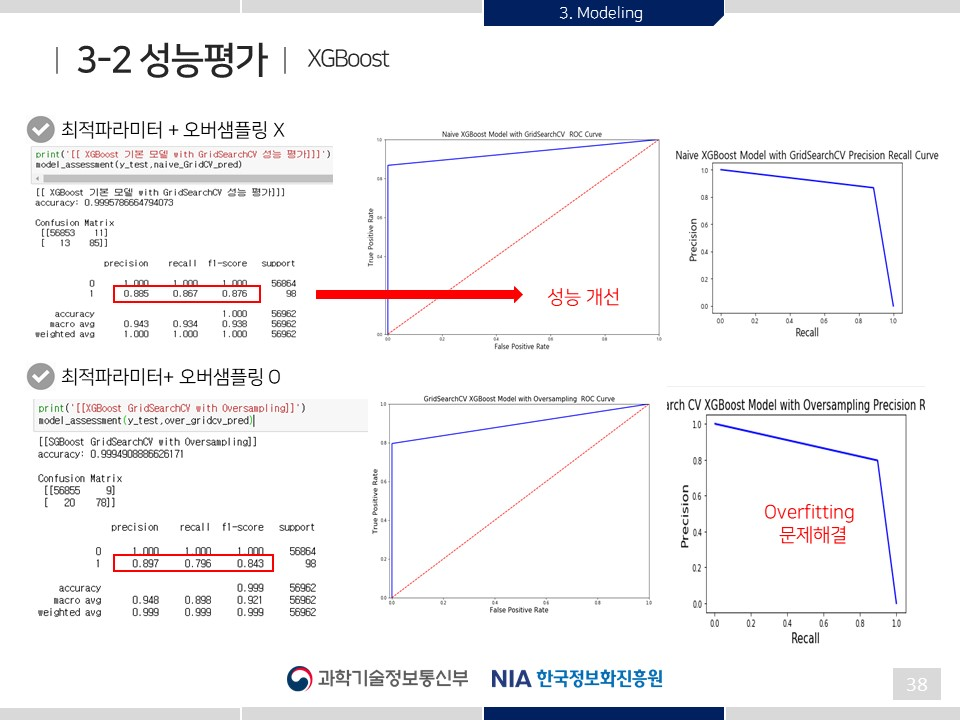

### (3) LightGBM

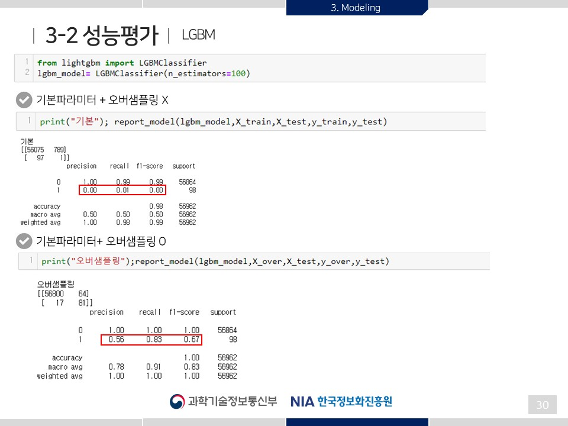

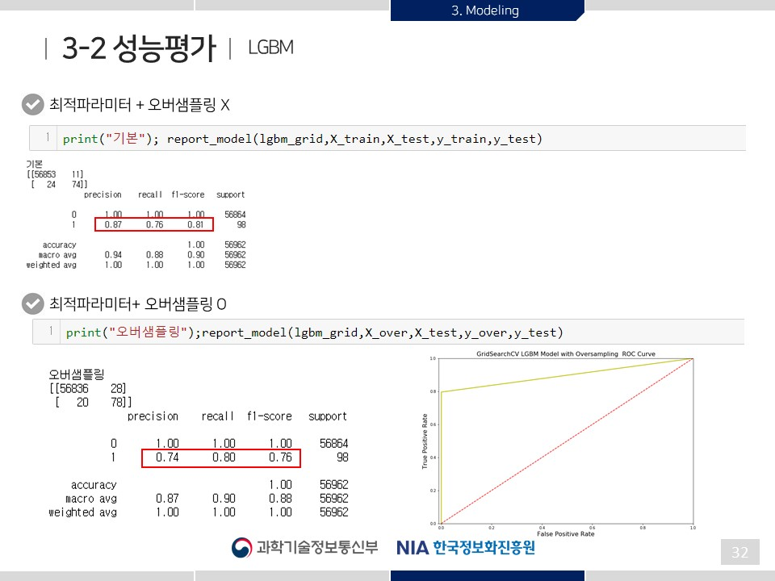

### (4) DNN

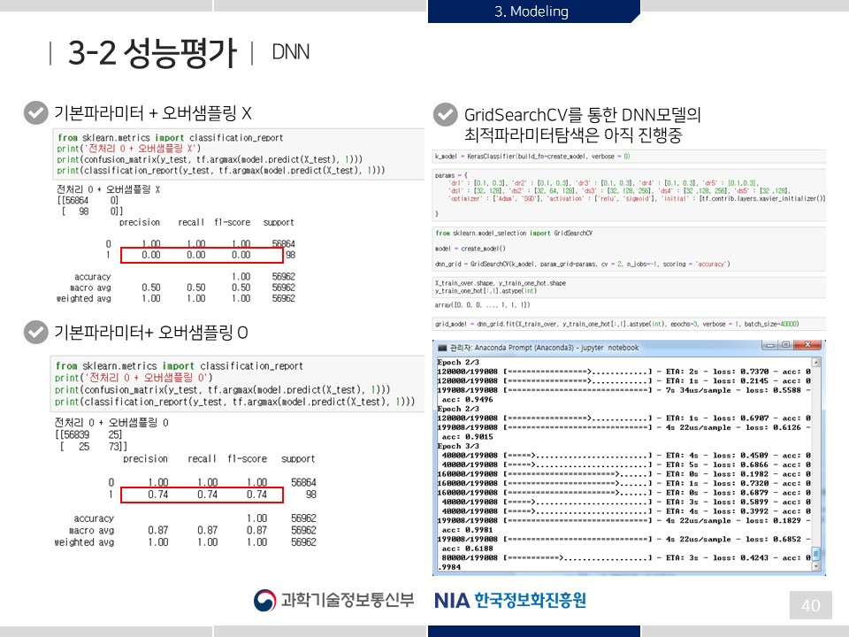

***

## 3-3 최종모델

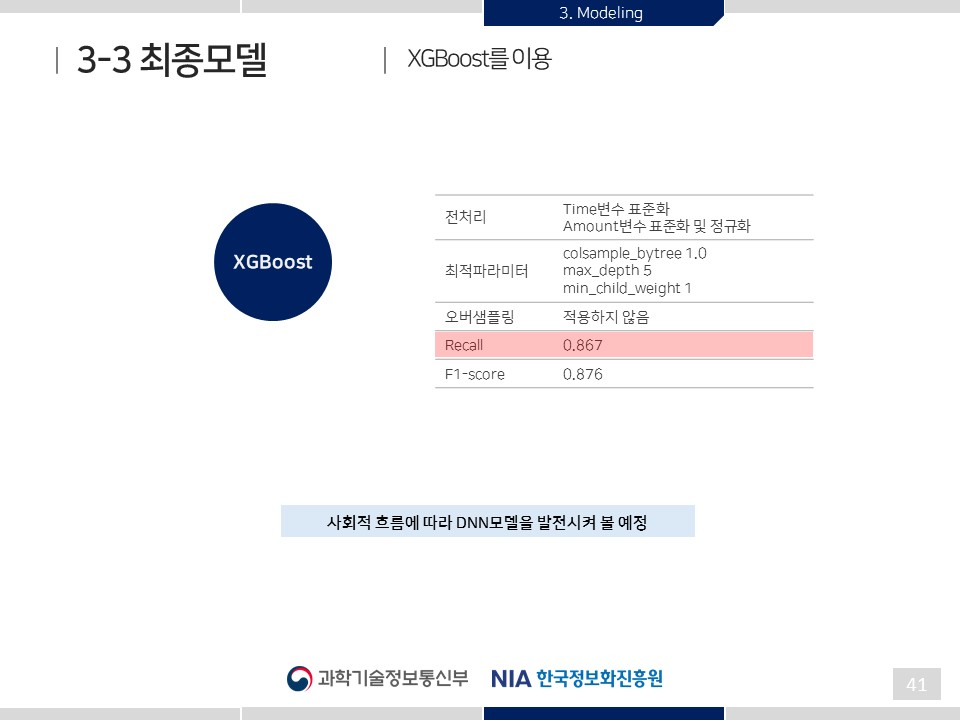

최종 모델 알고리즘은 XGBoost입니다. Recall 값이 높으면서도 Precision 값도  높았습니다.  

다만, 국내 금융업계의 FDS 구축 움직임에 따라 DNN 모델을 발전시킬 예정입니다.

***

***

# 4.Conclusion

## 4-1 향후 확장성

생성한 모델은 다양한 분야에 적용 가능합니다.

* 'IT' -  해킹 여부 / 네트워크 과부하 분류 및 예측
* 'CRM/Marketing' -  VIP 고객 이탈 여부 분류 및 예측
* '의료' - 질병 발생 여부 분류 및 예측
* '제조' - 기계 불량 여부 분류 및 예측

***

***

# ○ 참고자료

•의사결정나무를 이용한 이상금융거래 탐지 정규화 방법에 관한 연구 – 박재훈(2014)

•딥러닝을 이용한 전자금융이상거래 탐지 모델 수립 – 전일교(2017)

•신용카드사 빅데이터 활용 현황과 개인정보 규제 – 모정훈(2019)

•빅콘테스트 보험사기 분류 및 예측 : https://github.com/yunjihwan/data-analysis_bigcontest-2016 

•GridSearch VS RandomSearch : [http://aikorea.org/cs231n/neural-networks-3/#hyper](http://aikorea.org/cs231n/neural-networks-3/)

•모델 예측값 보정 : https://4four.us/article/2016/03/calibrating-model-prediction

•https://towardsdatascience.com/how-to-calibrate-undersampled-model-scores-8f3319c1ea5b

•불균형 데이터 처리 방법 : https://imbalanced-learn.readthedocs.io/en/stable/user_guide.html